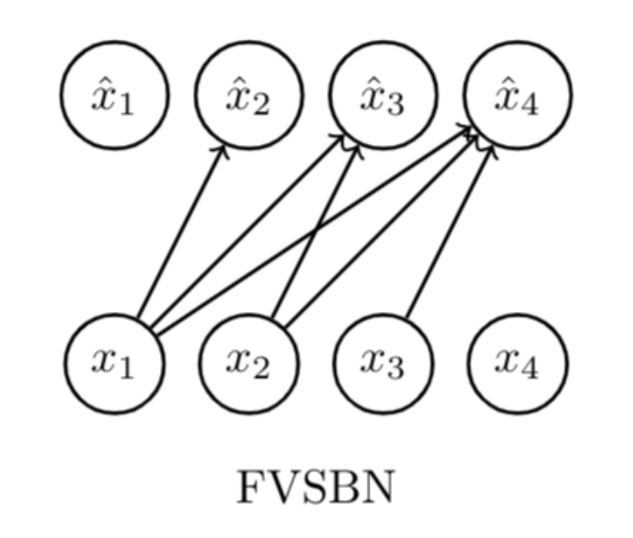
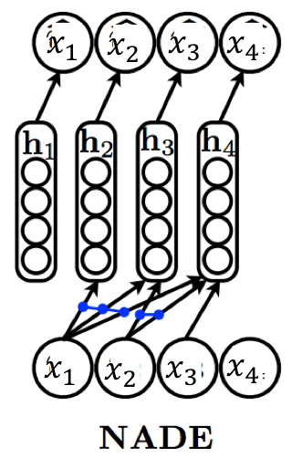
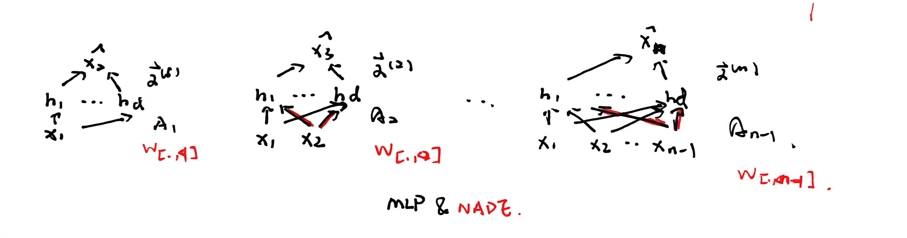

# Ch 2. Autoregressive Models

## Representation

The fundamental goal is to model the joint distribution $p(\mathbf{x})$ of $n$-dimensional data $\mathbf{x} \in \{0,1\}^n$.

### The Chain Rule Decomposition

Using the probability chain rule, any joint distribution can be decomposed into a product of conditionals:

$$p(\mathbf{x}) = \prod_{i=1}^{n} p(x_i \mid \mathbf{x}_{<i})$$

where $\mathbf{x}_{<i} = [x_1, \dots, x_{i-1}]$.

### The Autoregressive Property

A model is **autoregressive** if it respects a fixed ordering of variables. Each variable $x_i$ depends only on its predecessors.

While a tabular representation of these conditionals leads to exponential space complexity $O(2^n)$, ARMs use **parameterized functions** to keep the complexity manageable.

## Model Architectures

The evolution of ARMs is a journey from simple linear maps to efficient neural weight-sharing.

### FVSBN (Fully Visible Sigmoid Belief Network)

The simplest case where each conditional is a Logistic Regression:

$$
f_i(\mathbf{x}_{<i}) = \sigma\left( \alpha^{(i)}_0 + \sum_{j=1}^{i-1} \alpha^{(i)}_j x_j \right)
$$

- **Complexity:** $O(n^2)$ parameters.

<figure class="md-figure">
  </img>
</figure>

### MLP

Enhances expressivity by using an independent MLP for each $i$:

$$
\begin{aligned}
\mathbf{h}_i &= \sigma(\mathbf{A}_i \mathbf{x}_{<i} + \mathbf{c}_i), \\
f_i &= \sigma(\boldsymbol{\alpha}^{(i)} \mathbf{h}_i + b_i),
\end{aligned}
$$

where $\theta_i = \{\mathbf{A}_i \in \mathbb{R}^{d \times (i-1)}, \mathbf{c}_i \in \mathbb{R}^d, \boldsymbol{\alpha}^{(i)} \in \mathbb{R}^d, b_i \in \mathbb{R}\}$.

- **Complexity:** $O(n^2 d)$ parameters, where $d$ is the hidden layer size.

### NADE (Neural Autoregressive Density Estimator)

Do weight sharing:

$$\mathbf{h}_i = \sigma(\mathbf{W}_{.,<i} \mathbf{x}_{<i} + \mathbf{c}),$$

where $\theta = \{\mathbf{W} \in \mathbb{R}^{d \times n}, \mathbf{c} \in \mathbb{R}^d, \{\boldsymbol{\alpha}^{(i)} \in \mathbb{R}^d\}_{i=1}^n, \{b_i \in \mathbb{R}\}_{i=1}^n\}$.

- **Complexity:** $O(nd)$ parameters.

<figure class="md-figure">
  </img>
</figure>

Hidden states can be computed via a recursive update:

$$
\begin{aligned}
\mathbf{h}_i &= \sigma(\mathbf{a}_i), \\
\mathbf{a}_{i+1} &= \mathbf{a}_i + \mathbf{W}_{[.,i]} x_i.
\end{aligned}
$$

<figure class="md-figure">
  </img>
</figure>

### RNADE

### MADE

### RNN

### Generative Transformers

### PixelRNN

### PixelCNN

### PixelDefend

### WaveNet

## Learning & Inference

### Maximum Likelihood Estimation (MLE)

Learning is framed as minimizing the **Forward KL Divergence** $D_{\text{KL}}(p_{\text{data}} \parallel p_{\theta})$:

$$
\min_{\theta \in \Theta} D_{\text{KL}}(p_{\text{data}} \parallel p_{\theta}) = \mathbb{E}_{\mathbf{x} \sim p_{\text{data}}} \left[ \log p_{\text{data}}(\mathbf{x}) - \log p_{\theta}(\mathbf{x}) \right],
$$

which is mathematically equivalent to maximizing the **Log-Likelihood**:

$$
\max_{\theta \in \Theta} \mathbb{E}_{\mathbf{x} \sim p_{\text{data}}} \left[ \log p_{\theta}(\mathbf{x}) \right],
$$

and (if i.i.d.):

$$
\max_{\theta} \mathcal{L}(\theta \mid \mathcal{D}) = \frac{1}{|\mathcal{D}|} \sum_{\mathbf{x} \in \mathcal{D}} \sum_{i=1}^{n} \log p_{\theta_i}(x_i \mid \mathbf{x}_{<i}).
$$

**Optimization:** Solved via **Stochastic Gradient Ascent** (or Descent on the Negative Log-Likelihood) using **Autograd**.

$$
\theta^{(t+1)} = \theta^{(t)} + r_t \nabla_{\theta} \mathcal{L}(\theta^{(t)} \mid \mathcal{B}_t)
$$

!!! tip

    **Forward KL Property:** "Zero-avoiding," forcing the model to cover all modes of the data (ensuring diversity but potentially causing hallucinated samples).

### Inference Tasks

- **Density Estimation:** Parallelizable. We can compute all $p(x_i | \mathbf{x}_{<i})$ simultaneously if the input $\mathbf{x}$ is known.
- **Sampling:** Sequential. Must sample $x_1$, then $x_2$ given $x_1$, and so on. $O(n)$.
