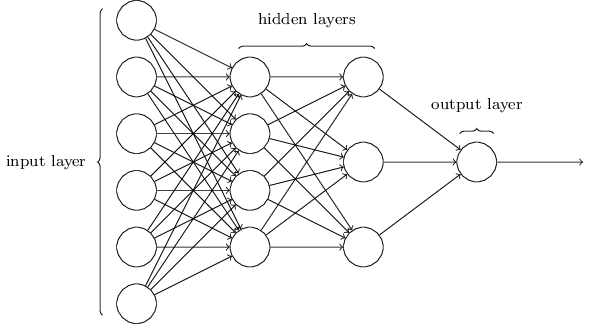

# Ch 1 & 2. MLP Foundations

## Architecture

<div align="center"></div>

A Multi-Layer Perceptron (MLP) consists of layers of sigmoid neurons.

## Notation

- $\sigma(z) = \frac{1}{1+e^{-z}}$, with $\sigma'(z) = \sigma(z)(1-\sigma(z))$.
- $\odot$: Hadamard product (element-wise multiplication, `*` in NumPy).
- $w^l_{jk}$: Weight from the $k^{th}$ neuron in layer $(l-1)$ to the $j^{th}$ neuron in layer $l$.
- $\delta^l_j$: The error of the $j^{th}$ neuron in layer $l$, i.e. $\frac{\partial C}{\partial z^l_j}$.

<div align="center"></div>

## Feed Forward

| Component Form                                                           | Matrix Form                                                                  |
| :----------------------------------------------------------------------- | :--------------------------------------------------------------------------- |
| $a^l_j = \sigma(\underbrace{\sum_k w^l_{jk} a^{l-1}_k + b^l_j}_{z^l_j})$ | $\vec{a}^l = \sigma(\underbrace{W^l \vec{a}^{l-1} + \vec{b}^l}_{\vec{z}^l})$ |

## Backpropagation

These equations calculate the gradient of the cost function $C$ with respect to weights and biases.

| ID      | Component Form                                                   | Matrix Form                                                                  | Description                                                                                            |
| :------ | :--------------------------------------------------------------- | :--------------------------------------------------------------------------- | :----------------------------------------------------------------------------------------------------- |
| **BP1** | $\delta^L_j = \frac{\partial C}{\partial a^L_j} \sigma'(z^L_j)$  | $\vec{\delta}^L = \nabla_{\vec{a}} C \odot \sigma'(\vec{z}^L)$               | **Error in the output layer $L$**: How much the cost changes w.r.t. the output activations.            |
| **BP2** | $\delta^l_j = \sum_k w^{l+1}_{kj} \delta^{l+1}_k \sigma'(z^l_j)$ | $\vec{\delta}^l = ((W^{l+1})^T \vec{\delta}^{l+1}) \odot \sigma'(\vec{z}^l)$ | **Error BP**: Propagates the error $\vec{\delta}$ backward from layer $l+1$ to layer $l$.              |
| **BP3** | $\frac{\partial C}{\partial b^l_j} = \delta^l_j$                 | $\frac{\partial C}{\partial \vec{b}^l} = \vec{\delta}^l$                     | **Bias gradient**: The rate of change of the cost w.r.t. any bias is exactly the error $\vec{\delta}$. |
| **BP4** | $\frac{\partial C}{\partial w^l_{jk}} = a^{l-1}_k \delta^l_j$    | $\frac{\partial C}{\partial W^l} = \vec{\delta}^l (\vec{a}^{l-1})^T$         | **Weight gradient**: The product of the activation "input" and the error "output".                     |

## Training

To minimize $C$, we adopt SGD. Update parameters using mini-batches of size $m$:

1. **Input:** A batch of training examples.
2. **Feedforward:** Compute $\vec{z}^l$ and $\vec{a}^l$ for each layer.
3. **Backpropagate:** Compute errors $\vec{\delta}^l$ using the 4 equations above.
4. **Update:**
    - $W^l \rightarrow W^l - \frac{\eta}{m} \sum \nabla_{W} C$
    - $\vec{b}^l \rightarrow \vec{b}^l - \frac{\eta}{m} \sum \nabla_{\vec{b}} C$
    - where $\eta$ is the learning rate

## Implementation

瞎写的。

??? example

    ```python
    import random
    import json
    import numpy as np


    class MLP(object):

        def __init__(self, sizes):
            self.num_layers = len(sizes)
            self.sizes = sizes
            self.biases = [np.random.randn(x, 1) for x in sizes[1:]]
            self.weights = [np.random.randn(y, x) for y, x in zip(sizes[1:], sizes[:-1])]

        def feedforward(self, a):
            for w, b in zip(self.weights, self.biases):
                a = sigmoid(w @ a + b)
            return a

        def SGD(self, training_data, epochs, mini_batch_size, eta, test_data=None):
            for epoch in range(epochs):
                random.shuffle(training_data)
                mini_batches = [
                    training_data[i : i + mini_batch_size]
                    for i in range(0, len(training_data), mini_batch_size)
                ]
                for mini_batch in mini_batches:
                    self.update_mini_batch(mini_batch, eta)

                loss = self.total_loss(training_data)
                out_str = f"Epoch {epoch}, loss: {loss:.4f}"
                if test_data:
                    acc = self.evaluate(test_data)
                    out_str += f", acc {acc}/10000"
                print(out_str)

        def update_mini_batch(self, mini_batch, eta):
            nabla_b = [np.zeros(b.shape) for b in self.biases]
            nabla_w = [np.zeros(w.shape) for w in self.weights]
            for x, y in mini_batch:
                delta_nabla_b, delta_nabla_w = self.backprop(x, y)
                nabla_b = [b + db for b, db in zip(nabla_b, delta_nabla_b)]
                nabla_w = [w + dw for w, dw in zip(nabla_w, delta_nabla_w)]
            self.biases = [
                b - eta / len(mini_batch) * db for b, db in zip(self.biases, nabla_b)
            ]
            self.weights = [
                w - eta / len(mini_batch) * dw for w, dw in zip(self.weights, nabla_w)
            ]

        def backprop(self, x, y):
            a = [np.zeros((x, 1)) for x in self.sizes]
            z = [np.zeros((x, 1)) for x in self.sizes[1:]]
            delta = [np.zeros((x, 1)) for x in self.sizes[1:]]

            # Forward and store z
            a[0] = x
            for i, (w, b) in enumerate(zip(self.weights, self.biases)):
                z[i] = w @ a[i] + b
                a[i + 1] = sigmoid(z[i])

            # delta for output layer
            delta[-1] = self.cost_derivative(a[-1], y) * sigmoid_prime(z[-1])

            # delta for hidden layer
            for i in range(len(delta) - 2, -1, -1):
                delta[i] = (
                    self.weights[i + 1].transpose() @ delta[i + 1] * sigmoid_prime(z[i])
                )

            nabla_b = delta
            nabla_w = [dd @ aa.transpose() for aa, dd in zip(a, delta)]

            return nabla_b, nabla_w

        def evaluate(self, test_data):
            test_results = [(np.argmax(self.feedforward(x)), y) for (x, y) in test_data]
            return sum(int(x == y) for (x, y) in test_results)

        def cost_derivative(self, output_activations, y):
            return output_activations - y

        def total_loss(self, data):
            loss = 0.0
            for x, y in data:
                a = self.feedforward(x)
                loss += 0.5 * np.linalg.norm(a - y) ** 2
            return loss / len(data)

    def sigmoid(z):
        return 1.0 / (1.0 + np.exp(-z))


    def sigmoid_prime(z):
        return sigmoid(z) * (1 - sigmoid(z))
    ```
