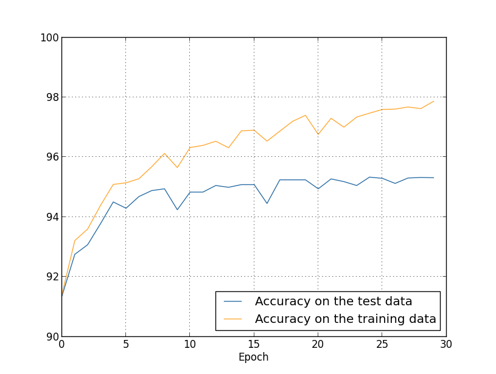

# Ch 3. Optimization of Learning

> We need good stories to help motivate and inspire us, and rigorous in-depth investigation in order to uncover the real facts of the matter.

## Cost Functions

### The Motivation: Gradient Desensitization

In a network using **Sigmoid neurons** and **Quadratic cost** ($C = \frac{1}{2}\|y-a\|^2$), the error in the output layer is

$$\delta^L_j = (a^L_j - y_j) \sigma'(z^L_j).$$

**Saturation Problem**: When a neuron saturates ($\sigma'(z) \approx 0$), learning stalls even if the error $(a-y)$ is huge.

So we want

$$\delta^L_j = a^L_j - y_j.$$

To achieve it, we "cancel out" the $\sigma'(z)$ term by choosing specific cost functions for different neuron types.

### Sigmoid Neurons & Cross-Entropy Cost

For binary or multi-label classification, we pair Sigmoid with **Cross-Entropy**:

$$C_x = -[y \ln a + (1-y) \ln(1-a)].$$

### Softmax & Log-Likelihood Cost

For exclusive multi-class classification, we use **Softmax** output and **Log-Likelihood** cost:

$$a_j^L = \frac{e^{z_j^L}}{\sum_k e^{z_k^L}},$$

$$C_x = -\ln a^L_{y},$$

where $y$ is the index of the correct label.

### Linear Neurons & Quadratic Cost

For regression tasks, **Linear neurons** paired with **Quadratic cost** naturally satisfy the condition.

$$C = \frac{1}{2}\|y-a\|^2.$$

## Overfitting

Occurs when what network learns no longer generalizes.

Solutions:

1. Increase the size of training data.
2. Reduce the size of the network.
3. Apply regularization techniques.

## Regularization

### L2 Regularization (Weight Decay)

Adds a penalty term proportional to the square of the weights to the cost function:

$$C = C_0 + \frac{\lambda}{2n} \sum_w w^2.$$

The resulting update rule is

$$w \to (1 - \frac{\eta\lambda}{n})w - \eta \frac{\partial C_0}{\partial w}.$$

**Effect:** Constrains weights to be small; improves generalization by penalizing sensitivity to noise.

### L1 Regularizatoin

Adds a penalty proportional to the absolute value of the weights:

$$C = C_0 + \frac{\lambda}{n} \sum_w |w|.$$

The resulting update rule is

$$w_{next} = w - \frac{\eta\lambda}{n} \text{sgn}(w) - \eta \frac{\partial C_0}{\partial w}.$$

**Effect:** Constant-rate shrinkage toward zero, leading to model sparsity.

### Dropout

A technique where neurons are randomly "dropped" during each training iteration with a probability $p$. At test time, all neurons are used with weights scaled down.

## Data Augmentation

Artificially expanding the training data by applying transformations to existing samples (e.g., rotations, cropping, flipping, or adding noise).

## Weight Initialization

Proper initialization prevents the "vanishing/exploding gradient" problem by keeping the variance of activations consistent across layers.

### Gaussian Initialization

$$w \sim N(0, 1).$$

It can lead to saturation in Sigmoid neurons.

### Xavier Initialization

$$w \sim N(0, \frac{1}{n_{in}}).$$

Scales weights based on the number of input connections to keep the signal variance stable.

## Optimizers

### Original Gradient Descent

$$w \to w − η \nabla C.$$

### Momentum

$$v \to \mu v - \eta \nabla C, \\ w \to w + v'.$$

Helps "roll" through local minima and flat regions.

### Adaptive

e.g. RMSProp, Adam, ...

## Hyper-parameters Tuning

- **Broad Strategy:** Start with a simplified network and a small subset of data to find a "reasonable" range for parameters quickly.
- **Learning Rate:** The most important hyper-parameter. Use a **learning rate schedule** (e.g., decaying $\eta$ when validation accuracy plateaus).
- **Batch Size**: Trade-off between speed and gradient stability.
- **Early Stopping:** Stop training as soon as the validation accuracy starts to decrease to prevent overfitting.
