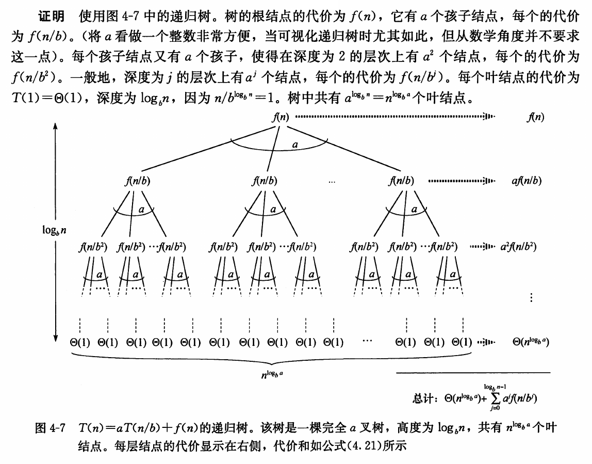
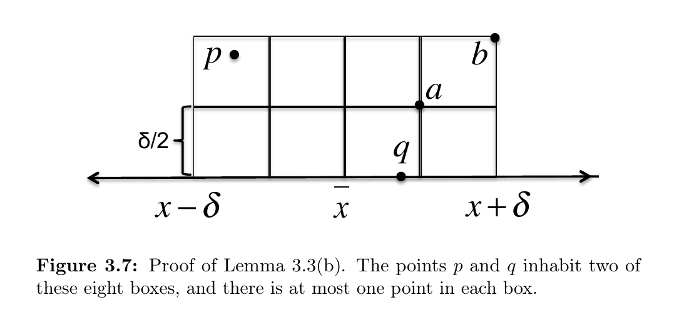

# Lec 7. Divide and Conquer

## Divide and Conquer

1. Divide;
2. Conquer;
3. Combine.

分治法递归的时间复杂度递推公式通常具有如下形式：

$$
T(n) = a T(\frac{n}{b}) + f(n).
$$

## Substitution

!!! info "推荐阅读"

    - [Lec 7: Divide and Conquer - NoughtQ 的笔记本](https://note.noughtq.top/algorithms/ads/7#substitution)

即猜证。

Must prove the exact form.

做题时有换元的技巧。

## Recursion Tree

最为通用的方法。

设

$$
T(n) = a T(\frac{n}{b}) + f(n),
$$

则

$$
T(n) = \Theta(n^{\log_b a}) + \sum_{i=0}^{\log_b n - 1} a^i f(\frac{n}{b^i}).
$$

<figure class="md-figure">
    
    <figcaption>使用递归树进行证明；截自《算法导论》。</figcaption>
</figure>

## The Master Theorem

在此基础上使用一些数学（详见《算法导论》对应章节），可得主定理：

对于

$$
T(n) = aT(\frac{n}{b}) + f(n), a \ge 1, b \ge 2,
$$

1.  若存在某个 $\epsilon > 0$，使得 $f(n) = O(n^{\log_b a - \epsilon})$，则 $T(n) = \Theta(n^{\log_b a})$；

2.  若 $f(n) = \Theta(n^{\log_b a})$，则 $T(n) = \Theta(n^{\log_b a} \log n)$；

3.  若存在某个 $\epsilon > 0$，使得 $f(n) = \Omega(n^{\log_b a + \epsilon})$，且对某个常数 $c < 1$ 和所有足够大的 $n$ 有 $a f(n/b) \leq c f(n)$，则 $T(n) = \Theta(f(n))$。

主定理的另一些版本可见手写笔记或其他人的笔记。

!!! tip

    以下这个更强的版本可以应付更多的考试题。

    对于递推式

    $$
    T(n) = aT(\frac{n}{b}) + \Theta(n^k \log^p n),
    $$

    其中 $a \ge 1, b > 1, k \ge 0$，$p$ 为任意实数，

    1. 若 $a > b^k$，则 $T(n) = \Theta(n^{\log_b a}).$
    2. 若 $a = b^k$：
        * (a) 若 $p > -1$，则 $T(n) = \Theta(n^k \log^{p+1} n);$
        * (b) 若 $p = -1$，则 $T(n) = \Theta(n^k \log \log n);$
        * (c) 若 $p < -1$，则 $T(n) = \Theta(n^k).$
    3. 若 $a < b^k$：
        * (a) 若 $p \ge 0$，则 $T(n) = \Theta(n^k \log^p n);$
        * (b) 若 $p < 0$，则 $T(n) = \Theta(n^k).$

## The Closest Points Problem

Lemma: In the `ClosestSplitPair` subroutine, suppose $(p, q)$ is a split pair with $d(p, q) < \delta$, where is the smallest distance between a left pair or right pair of points. Then:

- (a) $p$ and $q$ will be included in the set $S_y$;
- (b) at most six points of $S_y$ have a $y$-coordinate in between those of $p$ and $q$.

<figure class="md-figure">
    
    <figcaption>以上的 (b) 成立的原因；截自 <i>Algorithm Illuminated</i>。</figcaption>
</figure>

这是因为假设有两个点 $a, b$ 同时处于一个格子中，则 $d(a, b) \leq \frac{\delta}{\sqrt{2}} < \delta$，与 $\delta$ 的定义矛盾。

另外 7 并不是最小的常数；事实上该常数可以为 3。

## K-way Merge Sort

在 2-way Merge 操作中我们使用了双指针法；在 K-way Merge 操作中我们可使用 $k$ 指针法，每次从 $k$ 个指针中取出最小值。

朴素实现每次取出最小值的操作是 $O(k)$。考虑维护一个堆或锦标赛树，则每次取出最小值的时间复杂度为 $O(\log{k})$。设 $k$ 个数组共有 $n$ 个元素，则一次 K-way Merge 操作的总时间复杂度为 $O(n \log{k})$。故排序的总时间

$$
T(n) = k T(\frac{n}{k}) + O(n \log{k}).
$$

若将 $k$ 视为常数，则由主定理 $T(n) = O(n \log{n})$。但是若我们关心 $k$ 的影响，将 $k$ 视为变量，此时由于有两个变量，主定理不适用，需要画递归树进行求解。

??? example

    递归树的高度 $h = \log_{k}{n}$，第 $i$ 层（根节点为第 0 层）有 $k^i$ 个子问题，每个子问题的工作量为 $O(\frac{n}{k^i} \log{k})$。

    故总时间

    $$
    \begin{align*}
      T(n, k) &= \sum_{i = 0}^{h} k^i \cdot O(\frac{n}{k^i} \log{k}) \\
              &= \sum_{i = 0}^{h} O(n \log{k}) \\
              &= \log_{k}{n} \cdot O(n \log{k}) \\
              &= \frac{\log{n}}{\log{k}} \cdot O(n \log{k}) \\
              &= O(n \log{n}).
    \end{align*}
    $$

相较于二路，使用 $k$ 路的好处在于递归树变矮，坏处在于每一层的合并工作变重，直觉上二者可能会恰好抵消；计算过程中也确实如此。最终总时间 $T(n, k) = O(n \log{n})$，与 $k$ 无关。

在 External Sort 中还会提到 K-way Merge Sort。
