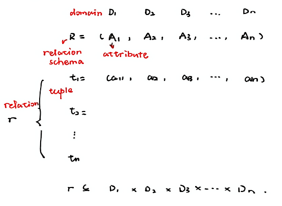
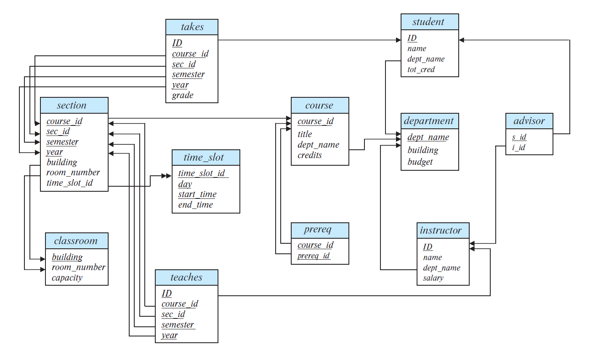
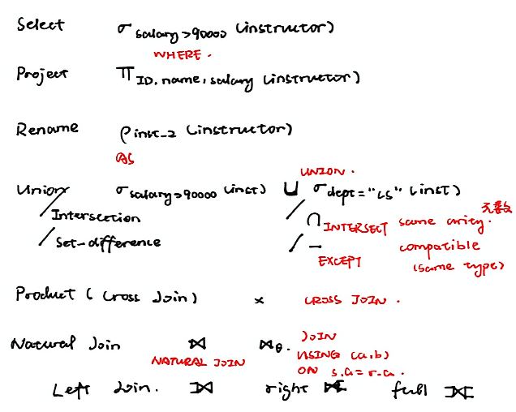
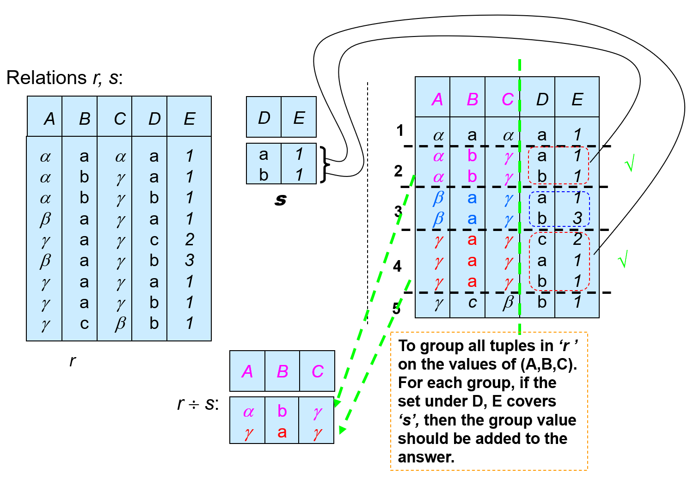
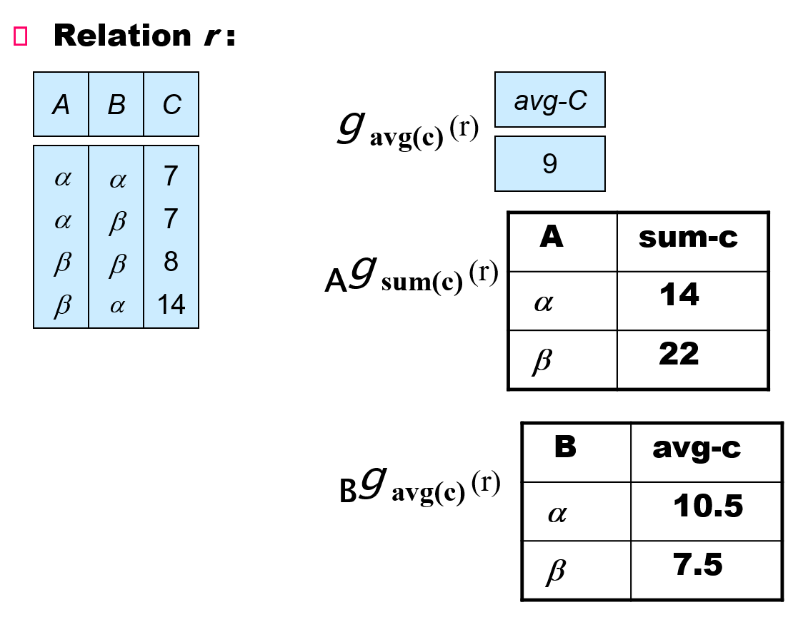

# Ch 2. Relation Model

## Relations



## Schema Diagrams



## Relational Algebra



## Extended Relational Algebra

### Divide

$$R \div S = \pi_{R-S}(R) - \pi_{R-S}\left( \left( \pi_{R-S}(R) \times S \right) - R \right).$$

To find maximal $q$ that satisfies $q \times S \subseteq r$.



!!! example

    Consider a university database schema designed to track student enrollments. The schema is defined as follows:

    - `student(sid, sname)`
    - `course(cid, cname)`
    - `enrollment(sid, cid)`

    In this schema, `sid` and cid `serve` as the primary keys for their respective tables, while enrollment links students to the courses they have attended.

    Task: Find the IDs of all students who have enrolled in every course listed in the course table.

    1. Provide the relational algebra expression that identifies these students. You must use basic operators (Selection, Projection, Cartesian Product, Set Difference) to express the logic of division without using the specialized division operator ($\div$).
    2. Write a SQL query to retrieve the sid of these students.

    ??? info "Answer"

        $$\pi_{sid}(student) - \pi_{sid}((\pi_{sid}(student) \times \pi_{cid}(course)) - enrollment)$$

        ```sql
        SELECT sid FROM student AS s
        WHERE NOT EXISTS (
            SELECT cid FROM course AS c
            EXCEPT
            SELECT cid FROM enrollment WHERE enrollment.sid = sc.sid
        );
        ```

### Aggregate Functions


