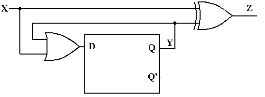
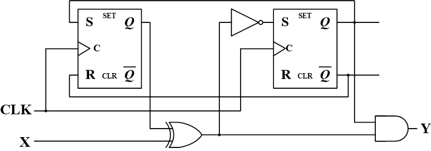
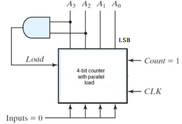
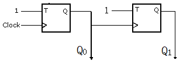
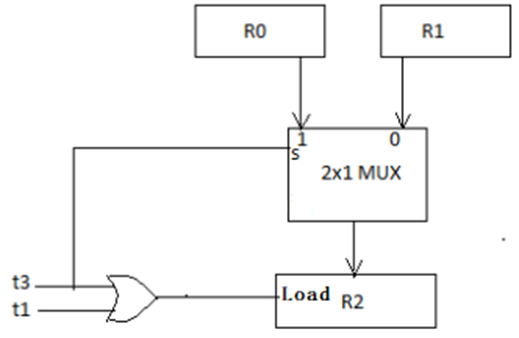

# Quizzes

## Quiz 1

1. Represent the decimal number 75 as a 7-bit binary number: `( 1 )`, and as a BCD code: `( 2 )`. Then add an even parity bit at the most significant bit (MSB) of the BCD code to form a 9-bit code: `( 3 )`.

2. Simplify the Boolean expression $XY + \bar{X}Z + X\bar{Y} + \bar{Y}Z$ to its minimum number of literals:
    - A: $Y + Z$
    - B: $X + Z$
    - C: $X + Y$
    - D: $X + Y + Z$

3. Which of the following expressions has its dual equal to its complement?
    - A: $\bar{A} + BC$
    - B: $\bar{A}B + BC$
    - C: $\bar{A}\bar{B} + BC$
    - D: $\bar{A}B + A\bar{B}$

4. What is the sum-of-minterms (SOM) form of the expression $F(A,B,C) = \bar{A}B + BC$?
    - A: $\sum m(2,3,7)$
    - B: $\sum m(0,1,4)$
    - C: $\sum m(2,4,6)$
    - D: $\sum m(2,3,6)$

??? info "Answer"

    1. As below:
        - **Binary Code**: $1001011_2$
            - $75 = 64 + 11$
        - **BCD Code**: $0111\ 0101$
        - **9-bit Code (Even Parity)**: $1\ 0111\ 0101$

    2. B ($X + Z$)
    3. D ($\bar{A}B + A\bar{B}$)
        - $f^D(x, y, z) = \bar{f}(x, y, z) = f^D(\bar{x}, \bar{y}, \bar{z}) \Longleftrightarrow f(x, y, z) = f(\bar{x}, \bar{y}, \bar{z})$
    4. A ($\sum m(2,3,7)$)

## Quiz 2

1. For the function $F = AB(C+D)+C(BD'+\bar{A}D)$, the **literal cost** is: `( 1 )`, and the **gate input cost with NOT (GN)** is: `( 2 )`.

2. Find the essential prime implicants for $F(W,X,Y,Z)= \sum m(0,1,4,6,7,8,9,12,14,15)$:
    - A: $Y'Z', XZ'$
    - B: $\bar{X}\bar{Y}, XY$
    - C: $XY, XZ'$
    - D: $Y'Z', \bar{X}\bar{Y}$

3. Find a minimal sum-of-products (SOP) expression for the function $F$ with the don’t-care conditions: $F(A,B,C,D)=\sum m(1,5,6,13,14)+ \sum d(4,12)$:
    - A: $B\bar{C}+\bar{A}\bar{C}D+BCD'$
    - B: $B\bar{D}+B\bar{C}+\bar{A}\bar{C}$
    - C: $\bar{C}D+B\bar{C}+B\bar{D}$
    - D: $B\bar{C}+B\bar{D}+\bar{A}\bar{C}D$

4. How many implicants, prime implicants (PI), and essential prime implicants (EPI) are there in $F(A,B,C)=\sum m(0,4,5)+ \sum d(1)$?
    - A: 8, 1, 1
    - B: 7, 1, 1
    - C: 6, 1, 1
    - D: 5, 3, 1

??? info "Answer"

    1. As below:
        - **Literal cost**: 9
        - **Gate input cost with NOT (GN)**: 17

    2. B ($\bar{X}\bar{Y}, XY$)
    3. D ($B\bar{C}+B\bar{D}+\bar{A}\bar{C}D$)
    4. A (8, 1, 1)
        - **Implicants**: 3 + 4 + 1 = 8.
        - **PI/EPI**: Combined term $\bar{C}$ covers all required minterms.

## Quiz 3

1. Find the $t_\text{PHL}$ from input C to the output D, assuming $t_\text{PHL}=0.20\text{ ns}$ and $t_\text{PLH}=0.36\text{ ns}$ for each gate.
 

   

   <ul>
     <li>A: 0.56 ns</li>
     <li>B: 0.6 ns</li>
     <li>C: 0.76 ns</li>
     <li>D: 0.92 ns</li>
   </ul>
 

2. Consider a 4-input priority encoder with inputs $D_3$, $D_2$, $D_1$, $D_0$. The encoder responds to the most significant 1 (highest priority to $D_3$). It produces outputs $A_1$, $A_0$ and a valid flag $V$, where $V=1$ indicates at least one input is 1. What is the logic expression for $V$?
    - A: $D_3D_2 + D_1D_0$
    - B: $D_3D_2 + D_1 + D_0$
    - C: $D_3D_2D_1 + D_0$
    - D: $D_3 + D_2 + D_1 + D_0$

3. Please find the logic expression of output $F$ in the figure.
 

   

   <ul>
     <li>A: $XY + X\bar{Y}$</li>
     <li>B: $\bar{X}\bar{Y} + XY$</li>
     <li>C: $\bar{X}Y + XY$</li>
     <li>D: $\bar{X}Y + X\bar{Y}$</li>
   </ul>
 

4. What specific Boolean function does the PLA implement for $F_2$?
 

   

   <ul>
     <li>A: $AC + BC$</li>
     <li>B: $\bar{C}+\bar{A}\bar{B}$</li>
     <li>C: $\bar{A}C + BC$</li>
     <li>D: $AC + B$</li>
   </ul>
 

??? info "Answer"

    1. C (0.76 ns)
    2. D ($D_3 + D_2 + D_1 + D_0$)
    3. B ($\bar{X}\bar{Y} + XY$)
    4. B ($\bar{C}+\bar{A}\bar{B}$)

## Quiz 4

1. For the decimal number $(-32)_{10}$ represented as an 8-bit signed binary number:
    1. The signed-magnitude representation is `( 1 )`;
    2. The signed-1's complement representation is `( 2 )`;
    3. The signed-2's complement representation is `( 3 )`.

2. Given two 4-bit signed 2's complement numbers, $A=(0100)_2$ and $B=(1101)_2$:
    1. The result of $A-B$ is `( 1 )`;
    2. Does overflow occur?

3. Which of the following statements about latch and flip-flop behavior is **CORRECT**?
    - A: Metastable state in a latch occurs when both inputs (S and R) are held at logic 0, causing the outputs to oscillate indefinitely.
    - B: Oscillation in a basic SR latch happens when both inputs are 0 and then return to 1 simultaneously, leading to an undefined or endless switching state if gate delays are equal.
    - C: 1s catching is a problem in edge-triggered D flip-flops, where a brief glitch on the D input during the clock edge can cause an incorrect output.
    - D: A metastable state is a stable, long-term condition that can be intentionally used to store an intermediate logic value.

4. As the sequential circuit shown below, determine its input equation, output equation, and next state equation.
 

   

   <ul>
     <li>A: $D=X\oplus Y, Z=X+Y, Q(t+1)=D$</li>
     <li>B: $D=X+Y, Z=X\oplus Y, Q=D(t+1)$</li>
     <li>C: $D=X+Y, Z=X\oplus Y, Q(t+1)=D$</li>
     <li>D: $D=X\oplus Y, Z=X+Y, Q=D(t+1)$</li>
   </ul>
 

5. The timing parameters for the gates and flip-flops are as follows: NOT Gate: $t_{pd}=0.75\text{ ns}$; XOR Gate: $t_{pd}=3.0\text{ ns}$; AND Gate: $t_{pd}=1.5\text{ ns}$; Flip-flop: $t_{pd}=3.0\text{ ns}$, $t_s=1.25\text{ ns}$, $t_h=0.5\text{ ns}$. Find the longest path delay from positive clock edge to an external output, and the maximum frequency of operation of the circuit.
 

   

   <ul>
     <li>A: 7.75 ns, 130 MHz</li>
     <li>B: 7.5 ns, 120 MHz</li>
     <li>C: 4.75 ns, 180 MHz</li>
     <li>D: 7.5 ns, 125 MHz</li>
   </ul>
 

??? info "Answer"

    1. 10100000, 11011111, 11100000
        - $32=(00100000)_2$.
        - Signed-magnitude: sign bit 1 plus magnitude 0100000 gives 10100000.
        - 1's complement: invert 00100000 gives 11011111.
        - 2's complement: add 1 to 11011111 gives 11100000.

    2. 0111, overflow does not occur
        - $A=4$, $B=-3$, so $A-B=4-(-3)=7=(0111)_2$.

    3. B
    4. C ($D=X+Y, Z=X\oplus Y, Q(t+1)=D$)
    5. D (7.5 ns, 125 MHz)
        - Clock-to-output longest path: $3.0+3.0+1.5=7.5\text{ ns}$.
        - Register-to-register critical period: $3.0+3.0+0.75+1.25=8.0\text{ ns}$, so $f_{\max}=125\text{ MHz}$.

## Quiz 5

1. What is the function of the following 4-bit counter with parallel load?
 

   

   <ul>
     <li>A: It counts from 0 to 12 and back to 0.</li>
     <li>B: It counts from 0 to 9 and back to 0.</li>
     <li>C: It counts from 0 to 10 and back to 0.</li>
   </ul>
 

2. Given two 8-bit registers $R1$ and $R2$, with $R1=(1011\ 0110)_2$ and $R2=(0111\ 1010)_2$. After two microoperations:
    1. $R1 \leftarrow sl\ R1$;
    2. $R1 \leftarrow R1 \oplus R2$.

    Then $R1=$ `( ? )`.
    - A: $0001\ 0110$
    - B: $0011\ 0110$
    - C: $1101\ 1110$
    - D: $0001\ 1110$

3. In the sequential circuit shown below, if the initial value of the output $Q_1Q_0$ is 00, what are the next four values of $Q_1Q_0$?
 

   

   <ul>
     <li>A: 11, 10, 01, 00</li>
     <li>B: 10, 11, 01, 00</li>
     <li>C: 10, 00, 01, 11</li>
     <li>D: 11, 10, 00, 01</li>
   </ul>
 

4. Choose the correct register transfer operations for the following diagram.
 

   

   <ul>
     <li>A: $t_1: R2 \leftarrow R1;\ t_3: R2 \leftarrow R0$</li>
     <li>B: $t_1: R2 \leftarrow R1;\ t_1't_3: R2 \leftarrow R0$</li>
     <li>C: $t_1t_3': R2 \leftarrow R1;\ t_3: R2 \leftarrow R0$</li>
   </ul>
 

5. You are designing a synchronous sequential circuit to detect the sequence "101" on a serial input stream. What is the minimum number of states required for a Mealy-type circuit and a Moore-type circuit, respectively?
    - A: Mealy: 3 states; Moore: 3 states
    - B: Mealy: 4 states; Moore: 4 states
    - C: Mealy: 3 states; Moore: 4 states
    - D: Mealy: 4 states; Moore: 5 states

??? info "Answer"

    1. A
        - The load signal is asserted when $A_3A_2=11$, so the counter loads $0000$ after reaching $1100_2=12$.

    2. A ($0001\ 0110$)
        - Shift left: $1011\ 0110 \to 0110\ 1100$.
        - XOR with $R2$: $0110\ 1100 \oplus 0111\ 1010 = 0001\ 0110$.

    3. A (11, 10, 01, 00)
        - Both T flip-flops have $T=1$, so they toggle. Starting from $Q_1Q_0=00$, the ripple sequence is $11 \to 10 \to 01 \to 00$.

    4. C
        - $t_1$ enables load and selects input 0 of the MUX, so $R2 \leftarrow R1$ when $t_1t_3'$.
        - $t_3$ enables load and selects input 1 of the MUX, so $R2 \leftarrow R0$.

    5. C
        - A Mealy detector can assert output on the transition that completes "101", requiring 3 states.
        - A Moore detector needs an extra output state after the sequence is detected, requiring 4 states.
