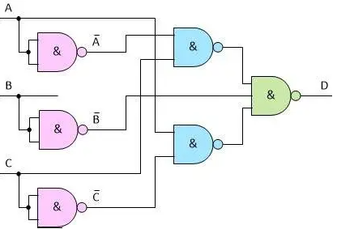
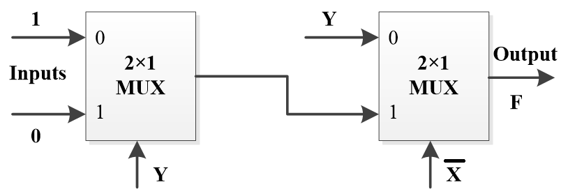
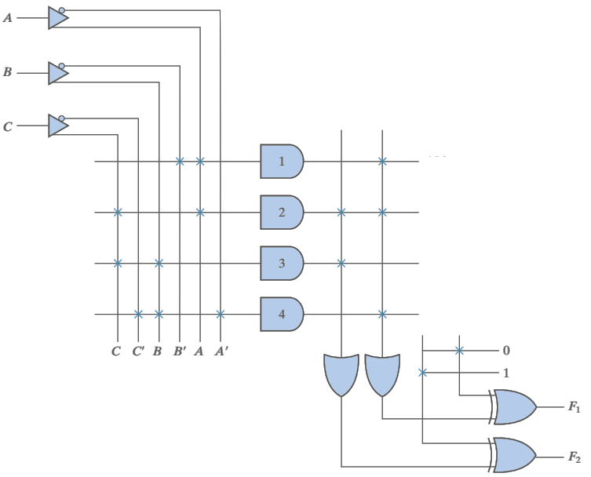

# Quizzes

## Quiz 1

1. Represent the decimal number 75 as a 7-bit binary number: `( 1 )`, and as a BCD code: `( 2 )`. Then add an even parity bit at the most significant bit (MSB) of the BCD code to form a 9-bit code: `( 3 )`.

2. Simplify the Boolean expression $XY + \bar{X}Z + X\bar{Y} + \bar{Y}Z$ to its minimum number of literals:
    - A: $Y + Z$
    - B: $X + Z$
    - C: $X + Y$
    - D: $X + Y + Z$

3. Which of the following expressions has its dual equal to its complement?
    - A: $\bar{A} + BC$
    - B: $\bar{A}B + BC$
    - C: $\bar{A}\bar{B} + BC$
    - D: $\bar{A}B + A\bar{B}$

4. What is the sum-of-minterms (SOM) form of the expression $F(A,B,C) = \bar{A}B + BC$?
    - A: $\sum m(2,3,7)$
    - B: $\sum m(0,1,4)$
    - C: $\sum m(2,4,6)$
    - D: $\sum m(2,3,6)$

??? info "Answer"

    1. As below:
        - **Binary Code**: $1001011_2$
            - $75 = 64 + 11$
        - **BCD Code**: $0111\ 0101$
        - **9-bit Code (Even Parity)**: $1\ 0111\ 0101$

    2. B ($X + Z$)
    3. D ($\bar{A}B + A\bar{B}$)
        - $f^D(x, y, z) = \bar{f}(x, y, z) = f^D(\bar{x}, \bar{y}, \bar{z}) \Longleftrightarrow f(x, y, z) = f(\bar{x}, \bar{y}, \bar{z})$
    4. A ($\sum m(2,3,7)$)

## Quiz 2

1. For the function $F = AB(C+D)+C(BD'+\bar{A}D)$, the **literal cost** is: `( 1 )`, and the **gate input cost with NOT (GN)** is: `( 2 )`.

2. Find the essential prime implicants for $F(W,X,Y,Z)= \sum m(0,1,4,6,7,8,9,12,14,15)$:
    - A: $Y'Z', XZ'$
    - B: $\bar{X}\bar{Y}, XY$
    - C: $XY, XZ'$
    - D: $Y'Z', \bar{X}\bar{Y}$

3. Find a minimal sum-of-products (SOP) expression for the function $F$ with the don’t-care conditions: $F(A,B,C,D)=\sum m(1,5,6,13,14)+ \sum d(4,12)$:
    - A: $B\bar{C}+\bar{A}\bar{C}D+BCD'$
    - B: $B\bar{D}+B\bar{C}+\bar{A}\bar{C}$
    - C: $\bar{C}D+B\bar{C}+B\bar{D}$
    - D: $B\bar{C}+B\bar{D}+\bar{A}\bar{C}D$

4. How many implicants, prime implicants (PI), and essential prime implicants (EPI) are there in $F(A,B,C)=\sum m(0,4,5)+ \sum d(1)$?
    - A: 8, 1, 1
    - B: 7, 1, 1
    - C: 6, 1, 1
    - D: 5, 3, 1

??? info "Answer"

    1. As below:
        - **Literal cost**: 9
        - **Gate input cost with NOT (GN)**: 17

    2. B ($\bar{X}\bar{Y}, XY$)
    3. D ($B\bar{C}+B\bar{D}+\bar{A}\bar{C}D$)
    4. A (8, 1, 1)
        - **Implicants**: 3 + 4 + 1 = 8.
        - **PI/EPI**: Combined term $\bar{C}$ covers all required minterms.

## Quiz 3

1. Find the $t_\text{PHL}$ from input C to the output D, assuming $t_\text{PHL}=0.20\text{ ns}$ and $t_\text{PLH}=0.36\text{ ns}$ for each gate.
 

   

   <ul>
     <li>A: 0.56 ns</li>
     <li>B: 0.6 ns</li>
     <li>C: 0.76 ns</li>
     <li>D: 0.92 ns</li>
   </ul>
 

2. Consider a 4-input priority encoder with inputs $D_3$, $D_2$, $D_1$, $D_0$. The encoder responds to the most significant 1 (highest priority to $D_3$). It produces outputs $A_1$, $A_0$ and a valid flag $V$, where $V=1$ indicates at least one input is 1. What is the logic expression for $V$?
    - A: $D_3D_2 + D_1D_0$
    - B: $D_3D_2 + D_1 + D_0$
    - C: $D_3D_2D_1 + D_0$
    - D: $D_3 + D_2 + D_1 + D_0$

3. Please find the logic expression of output $F$ in the figure.
 

   

   <ul>
     <li>A: $XY + X\bar{Y}$</li>
     <li>B: $\bar{X}\bar{Y} + XY$</li>
     <li>C: $\bar{X}Y + XY$</li>
     <li>D: $\bar{X}Y + X\bar{Y}$</li>
   </ul>
 

4. What specific Boolean function does the PLA implement for $F_2$?
 

   

   <ul>
     <li>A: $AC + BC$</li>
     <li>B: $\bar{C}+\bar{A}\bar{B}$</li>
     <li>C: $\bar{A}C + BC$</li>
     <li>D: $AC + B$</li>
   </ul>
 

??? info "Answer"

    1. C (0.76 ns)
    2. D ($D_3 + D_2 + D_1 + D_0$)
    3. B ($\bar{X}\bar{Y} + XY$)
    4. B ($\bar{C}+\bar{A}\bar{B}$)
