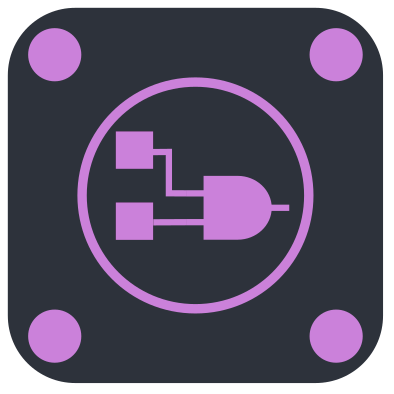

# 在 Linux 上编写 HDL

## 在 Linux 上安装 Vivado

在 Xilinx Vivado 官网下载 Linux Self Extracting Web Installer，运行二进制文件进行安装即可。

也可以尝试使用包管理器进行安装。

## 开源工具链

主要包括 iverilog、Verilator、GTKWave、Yosys 等工具，可自行探索。

## 在 VSCode 上安装与使用 Digital IDE

> Digital IDE (简称为 DIDE) 是一个给数字开发工作者提供的友好便捷的自研开发工具。DIDE 可以运行在常规的所有平台上（Windows，Linux，MacOS）上。对于常年使用 ssh 连接内网服务器工作的工程师，DIDE 也能支持远程开发状态下的各项功能支持。
>
> 我们致力于文件结构即工程结构的开发思想，并借助规范的、简化的、可视的工程管理系统、IP管理系统以及丰富的辅助组件，帮助下游的开发者能够满足研发过程中敏捷开发、验证以及团队协作等需求。对于上游，帮助FPGA原厂降低软件开发生态的扩展和维护成本。
>
> <p style="text-align: right;">—— <a href="https://nc-ai.cn/">Digital IDE: All your need for FPGA & IC</a></p>

<div align="center"></img></div>

Digital IDE 是一个 VSCode 插件；具体安装与使用教程参照 Digital IDE 官方文档即可。

正确配置后，Digital IDE 可以根据配置使用相应工具完成 HDL 编写、仿真、生成下载比特流等系列操作，通常不必再打开 Vivado 本体。

!!! tip

    编写仿真文件并使用 Digital IDE 进行仿真时，有一些需要注意的点：

    - 注意添加 `$dumpfile` 与 `$dumpvars` 语句，否则不会生成 `vcd` 波形文件或文件内没有波形；

    - 注意添加 `$finish` 语句（不可以是 `$stop` 语句），否则仿真进程永远不会停止。

    ```systemverilog
    `timescale 1ns / 1ps

    module add32_tb();

        initial begin
            $dumpfile("add32_tb.vcd");
            $dumpvars(0, add32_tb);

            // something

            $finish();
        end

    endmodule
    ```
