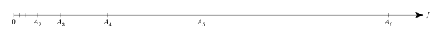

# 声音原理

## 弦乐器发声的原理

乐器包括弦乐器与管乐器等。

我们知道声音由振动产生。管乐器的原理是管内空气柱振动发声，由于需要考虑空气柱在管口边上的逸出部分，管乐器音律的调节较为复杂；而弦乐器具有更理想的物理特性，故使用弦乐器能够更方便地调节音律。

具体而言，考虑一个长度为 $L$ 的理想弦，其振动发出纯音（正弦波）。它的振动频率 $f$ 满足以下公式：

$$
  f = \frac{1}{2L} \sqrt{\frac{F}{\rho}}
$$

其中 $L$ 为弦的长度，$F$ 为弦的张力，$\rho$ 为弦的线密度。

我们可以看到，弦的振动频率与弦的长度呈反比。而人耳所听到的音调是由频率决定的；因此，通过调整弦的长度，我们能够很方便地定量调节弦的音调。

## 泛音与泛音列

一般而言，除整体振动之外，我们还需要考虑弦的分段振动。弦分段振动的长度依次为 $\frac{1}{2}L, \frac{1}{3}L, \frac{1}{4}L, \cdots$

将这些长度代入刚刚的公式，我们可以得出不同分段振动产生的频率：

$$
  f_1 = \frac{1}{2L} \sqrt{\frac{F}{\rho}}
$$

$$
  f_2 = \frac{2}{2L} \sqrt{\frac{F}{\rho}}
$$

$$
  \vdots
$$

$$
  f_n = \frac{n}{2L} \sqrt{\frac{F}{\rho}}
$$

$$
  \vdots
$$

其中 $f_1$ 称为基音，$f_n$ $(n > 1)$ 称为泛音；这一组声音称为分音列，分音列去掉基音则称为泛音列。这些频率一起构成了我们日常生活中所听到的乐音。

人耳一般认为基音的频率即为该音的频率，不过很专心时也有可能听到泛音。可以认为，基础音决定音调，分音列的成分决定音色。

事实上这与傅里叶变换原理相通。如果我们对一个乐音信号进行傅里叶变换，得到的频谱中的共振峰正是泛音列的频率成分；我们可以据此分析得到一些信息，例如辨别它由何种乐器演奏。

## 八度与五度

自然泛音列中的频率成分是基频的整数倍。像这样频率成整数倍的声音，常常给人耳带来和谐的感觉。以下举两个典型且重要的例子。

注意到 $f_1$ 与 $f_2$ 之间呈现 $1:2$ 的比例关系。这样的两个音在人耳听来几乎就是同一个音的不同版本，仅仅是高低之别，音质非常相似。这里如果我们暂时引入现代音乐理论，取 $f_1$ 为 do (C5)，那么 $f_2$ 在我们听来就是高一个八度的 do (C6)。现代音乐理论中，这种 $1:2$ 的比例关系称为八度关系，使用同样的音名。

注意到 $f_2$ 与 $f_3$ 之间呈现 $2:3$ 的比例关系。这样的两个音如果同时弹奏，在人耳听来尤其协和动听。若取 $f_2$ 为 do (C5)，那么 $f_3$ 在我们听来就是 sol (G5)。现代音乐理论中，这种 $2:3$ 的比例关系称为纯五度关系，是重要的协和音程之一。

至于为什么是「八」和「五」，后文将提到，这里且卖个关子。

## 人类的对数知觉

前文提到，相隔一个八度的两个音，其振动频率相差一倍；不过在人耳听来，它们相差的是一个八度音程。

例如对于不同八度的 la 而言，我们人耳会认为它们的音程是等距的，就像在键盘上这样：

_待补图_

（A4 即为低音 la，A5 为中音 la，A6 为高音 la。）

虽然这些音程在人耳中显得等距，不过它们的频率实际上是按照 $1:2$ 的比例关系递增的。如果将它们按频率标记，数轴上的位置如下所示：

这些音在人耳听来呈等差数列，其实它们的频率呈等比数列。

这样的对数感知在很多人类感官中都有体现；譬如 2023 年全国新高考 I 卷数学第 10 题告诉我们，人类对音量变化的感知也是对数的。

!!! info "韦伯—费希纳定律"

    心理学家韦伯认为，感觉的差别阈限随原来刺激量的变化而变化。

    > 以韦伯的实验为例：左手与右手都拿上 100g 的重物，我们让右手的重物逐渐变重。当右手的重量增加到 105g 时，实验者能感觉到差异了。类似地，左右手都拿 10kg，同时让右手增加到 10.005kg；同样是左右手相差 5g，此时差异则几乎无法察觉。直到重物增重至 10.5kg 时，人类才感知到二者的差异。韦伯首先发现重量的最小可觉差，并发现两重物之间的最小可觉差与标准刺激之比为一常数。

    一般地，设感觉强度为 $p$，则感觉的微小变化为 $\mathrm{d}p$；设外界刺激的强度为 $S$，则外界刺激的微小变化为 $\mathrm{d}S$。那么韦伯定律可以写作：

    $$
      \mathrm{d}p = k \frac{\mathrm{d}S}{S}
    $$

    解该微分方程，得到的即为费希纳定律：

    $$
      p = k \ln{S} + C
    $$

    两条定律合称为「韦伯—费希纳定律」。

    该定律显示：很多时候人类的感知是基于相对的比例而非绝对的数值，体现了对数的特性。
